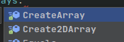

# I learn the best programming language C#

# Roadmap for my learning the c#

> # live story
>> 

story
I saw a video on youtube. something like this:how to write your first program.and I wanted to start studying this business myself, but since I didn’t have a smart computer, I just watched the video and tried not this language, but the HTML markup language, and something seemed to work out. I simultaneously studied at a technical school as a builder, but I did not like this profession. I finished my studies and went into the army, then I moved in with my brother and began to get serious, having bought myself a laptop before that, but at first I could not decide what I wanted and studied everything that was not nailed down, but soon I seriously decided to study C#

# Table of contents
##  Part 1. Introducing on C#
1.  
    1. )
        1. 
    2. 
    3. 
    4. 
    5. 
    6. 
    7. 
    8. 
    9. 
2. 
      1. 
      2. 
      3. 
3. 
    1. 
    2. 
    3. 
4. 
    1. 
    2. 
    3. 
    4. 
5. 
    1. 
    2. 
6. 
## Part 2. Advanced C#
1. 
    1. 
    2. 
3. 
   1. 
   2. 
   3. 
4. 
   1. 
   2. 
   3. 
   4. 
5. 
   1. 
   2. 
6. 
## Part 2. Advanced C#
1. 
   1. 
   2. 
2. 
3. 
4. 
5. 
    1. 
    2. 
    3. 
6. 
7. 
8. 
   1. 
   2. 
   3. 

# Images

images

Methods

void:

returnable:

Arrays

1 dimesion:

Multidemensial:

Stepped arrays

Acess modifiers

private

try invoke this method in main 

public

try invoke this method in main 

protected

try invoke this method in main 

Delegates:

# Additional Links

# Books
CLR via C#
C# Head First

 

 Special Symbols
 
\n - new line,
\t - tab,

\r - teleport the cursor to start of line  
 \b - split 2 last digits   

